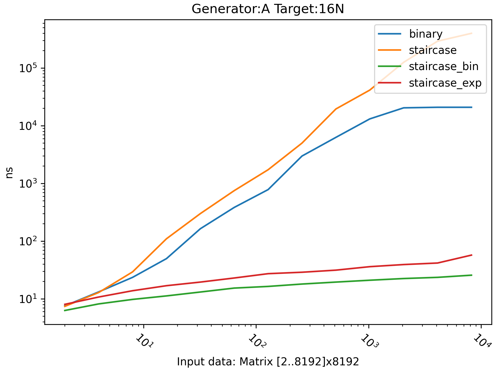
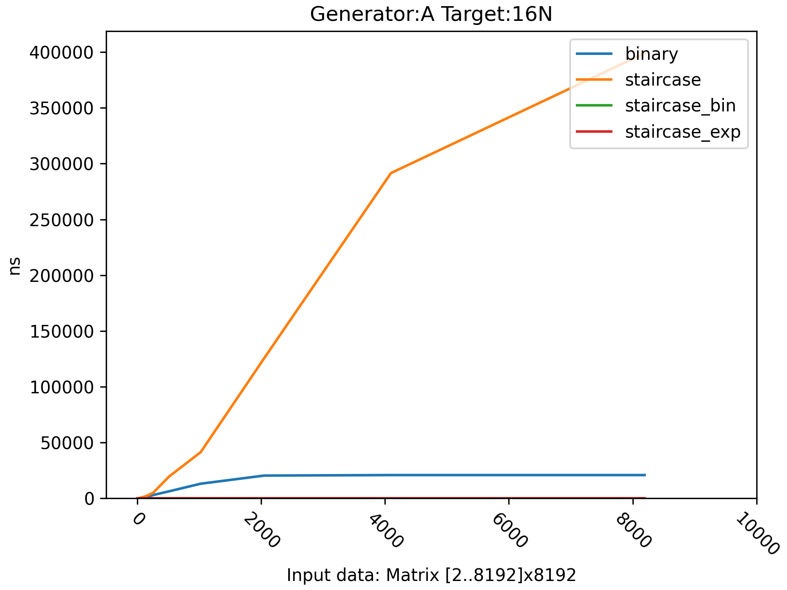
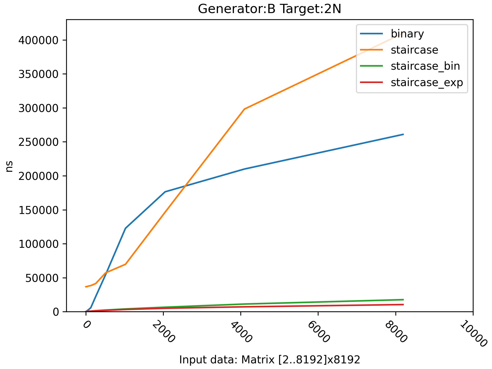
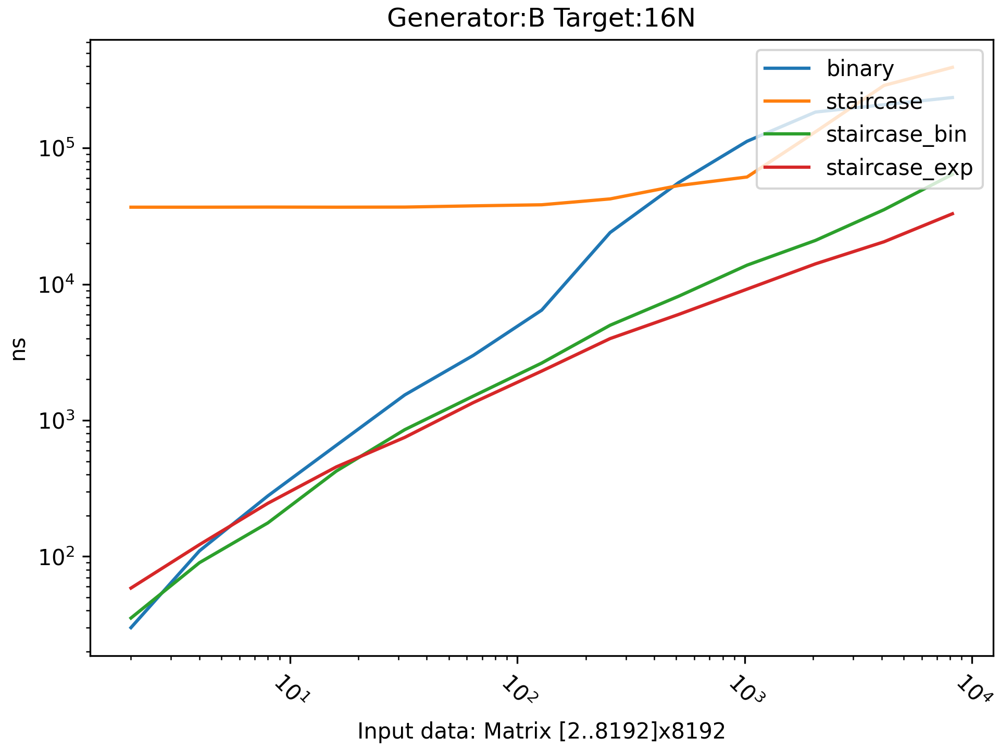

# Как и на чём запускать

**Windows**:  
MinGW-GCC version 12.1.0 (Без сборки параметризованных тестов из googletest)  
MinGW-Clang version 14.0.4  
**Linux/MacOS**:  
GNU-GCC version 11.2.0  
LLVM-Clang version 14.0.0
Apple-Clang version 13.0.0

- Основной функционал прописан на C++11 без использования сторонних библиотек
- Для тестирования использованы [googletest](https://github.com/google/googletest) и [gtest-parallel](https://github.com/google/gtest-parallel)
- Для замеров использован [benchmark](https://github.com/google/benchmark)  
- Чтобы запустить проект и воспользоваться основным функционалом достаточно клонировать его к себе и собрать через `cmake` цель `Matrix_App`
- Точка входа в приложение находится в файле src/main.cpp
- Для запуска тестов и бенчмарка необходимо инициализировать и обновить модули командами 

```bash
$ git submodule init
$ git submodule update
``` 

**CMake targets:**
- `Matrix_App` - entry-point
- `Matrix_Test` - googletest
- `Matrix_Benchmark` - google-benchmark

**Google Benchmark:**
- Собрать цель `Matrix_Benchmark`
- Запустить исполняемый файл со следующими параметрами:

```bash
--benchmark_repetitions=3
--benchmark_out="{Path-from-binary-to-root-folder}/log/benchmark/Overall.json"
--benchmark_out_format=json
--benchmark_filter=Search*
```

- Запустить parse_benchmark.py
- Запустить charts.py
- Графики находятся в директории log/charts

**GTest-parallel:**
- Собрать цель `Matrix_Test` 
- Запустить gtest-parallel в формате: 

```bash
$ gtest-parallel {path_to_binary}
```
*Исполняемый файл gtest-parallel находится в директории external/gtest-parallel*

# Реализация

## Генерация матриц

## Генерация A

<https://github.com/ruslanSorokin/algorithms-hw-1/blob/4605ec427031205710e8639fe64415a35a7873f6/src/generator.cpp#L3-L12>

## Генерация B

<https://github.com/ruslanSorokin/algorithms-hw-1/blob/4605ec427031205710e8639fe64415a35a7873f6/src/generator.cpp#L14-L23>

## Генерация C

Не уверен нужно ли было это делать, но, по-моему, на какой-то из практик Вы говорили, что нужно сделать рандомизированное заполнение.

<https://github.com/ruslanSorokin/algorithms-hw-1/blob/4605ec427031205710e8639fe64415a35a7873f6/src/generator.cpp#L25-L67>

## Алгоритмы поиска

## Линейный

**O(M * N)**

<https://github.com/ruslanSorokin/algorithms-hw-1/blob/4605ec427031205710e8639fe64415a35a7873f6/src/search.cpp#L3-L17>

## Бинарный(варьируемый в зависимости от отношения MxN)

**O(min(M, N) * log(max(M, N)))**

<https://github.com/ruslanSorokin/algorithms-hw-1/blob/4605ec427031205710e8639fe64415a35a7873f6/src/search.cpp#L67-L119>

### Вспомогательные функции

- Горизонтальная нижняя граница:

<https://github.com/ruslanSorokin/algorithms-hw-1/blob/4605ec427031205710e8639fe64415a35a7873f6/src/search.cpp#L51-L65>

- Вертикальная нижняя граница:

<https://github.com/ruslanSorokin/algorithms-hw-1/blob/4605ec427031205710e8639fe64415a35a7873f6/src/search.cpp#L19-L33>

## Лестничный

**O(M + N)**

<https://github.com/ruslanSorokin/algorithms-hw-1/blob/4605ec427031205710e8639fe64415a35a7873f6/src/search.cpp#L121-L140>

## Лестничный-бинарный

**O(M * log(N))**

<https://github.com/ruslanSorokin/algorithms-hw-1/blob/4605ec427031205710e8639fe64415a35a7873f6/src/search.cpp#L142-L161>

### Вспомогательные функции

- Горизонтальная нижняя граница:

<https://github.com/ruslanSorokin/algorithms-hw-1/blob/4605ec427031205710e8639fe64415a35a7873f6/src/search.cpp#L51-L65>

- Вертикальная верхняя граница:

<https://github.com/ruslanSorokin/algorithms-hw-1/blob/4605ec427031205710e8639fe64415a35a7873f6/src/search.cpp#L35-L49>

## Лестничный-экспоненциальный

**O(M * log(N))**

<https://github.com/ruslanSorokin/algorithms-hw-1/blob/4605ec427031205710e8639fe64415a35a7873f6/src/search.cpp#L203-L222>

### Вспомогательные функции

- Горизонтальный экспоненциальный:

<https://github.com/ruslanSorokin/algorithms-hw-1/blob/4605ec427031205710e8639fe64415a35a7873f6/src/search.cpp#L163-L182>

- Вертикальный экспоненциальный:

<https://github.com/ruslanSorokin/algorithms-hw-1/blob/4605ec427031205710e8639fe64415a35a7873f6/src/search.cpp#L184-L201>

# Результаты

## Benchmark overall report
**Search:**  
0 : Linear  
1 : Binary  
2 : Staircase  
3 : Staircase_with_binary  
4 : Staircase_with_exponential  
**Generator:**  
0 : A  
1 : B  
**Target:**  
0 : 2N + 1  
1 : 16N + 1  

<https://github.com/ruslanSorokin/algorithms-hw-1/blob/4605ec427031205710e8639fe64415a35a7873f6/log/benchmark/Overall.txt#L10-L271>

## Первая часть

### Генерация A





### Генерация B






## Вторая часть

